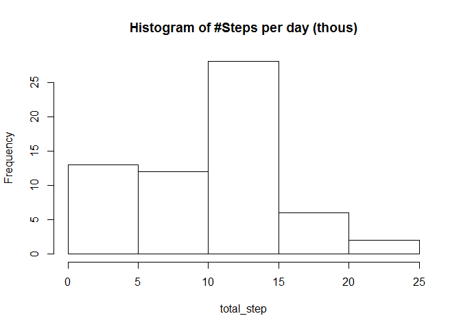
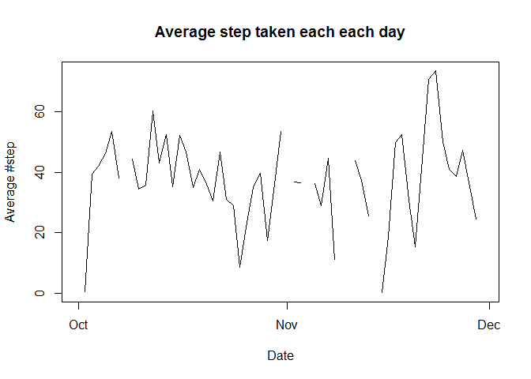
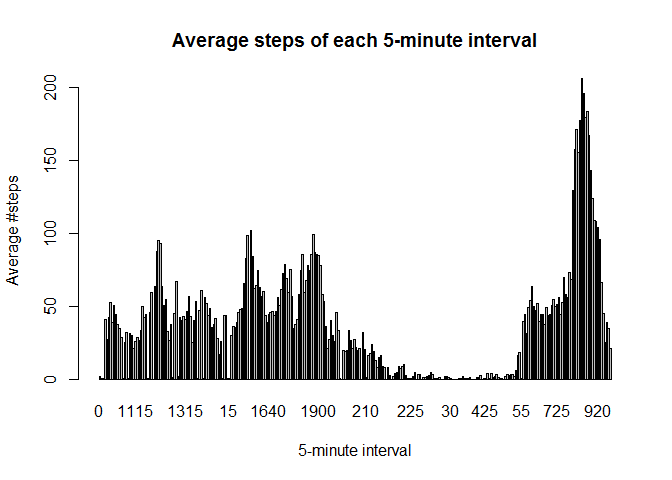
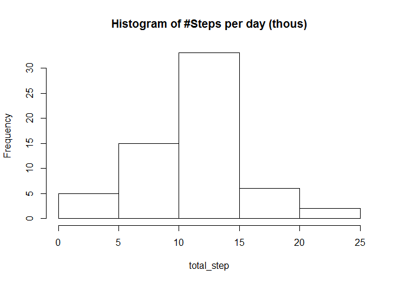
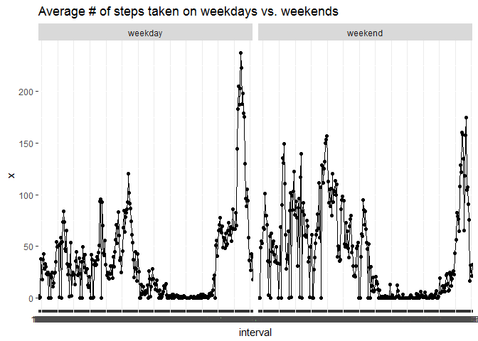

**Activity monitoring data - at a 1st glance**
==============================================

1) Loading data
---------------

First, we load the dataset. For future considerations, we load
everything as character strings, then transorfm **'steps'** into
numeric, use the **'interval'** variable as a factor, and we tranform
the **'date'** variable into further factor variables.

    #This regional setting causes funny consequences
    Sys.setlocale("LC_TIME", "English")

    ## [1] "English_United States.1252"

    #Loading data
    data <- read.csv("activity.csv", header=TRUE, sep=",",
                     na.strings="NA", colClasses = "character")

    data$steps <- as.numeric(data$steps)

    data$interval <- as.factor(data$interval)

    data$date <- strptime(data$date, format="%Y-%m-%d")
    day <- as.factor(weekdays(data$date, abbreviate=TRUE))
    weekday <- factor((day=="Sat" | day=="Sun") +1 , levels=1:2, labels=c("weekday","weekend"))

    data <- cbind(data, day, weekday)

Plots and figures to be submitted
---------------------------------

In the forthcoming parts of the document, we process and visualize data
for the assigment.

### 2) Histogram of the total number of steps taken each day

Please note, that there is no imputation for the missing data. First, we
need to sum up every step per each day.

    total_step <- tapply(data$steps, as.character(data$date), sum, na.rm=TRUE)
    total_step <- total_step/10^3

    hist(total_step, main="Histogram of #Steps per day (thous)")

### 3) Mean and median number of steps taken each day

Similarly to the previous section, we start with summing up of the daily
\#steps.

    total_step <- tapply(data$steps, as.character(data$date), sum, na.rm=TRUE)
    total_step <- total_step/10^3

    mean_per_day <- round(mean(total_step, na.rm=TRUE), 3)
    median_per_day <- round(median(total_step, na.rm=TRUE), 3)

Having our results, we can say, that the average steps taken per day is
**9.354** (in thous), while the median value is **10.395** (in thous)
per day.

### 4) Time series plot of the average number of steps taken

For this question, we calculate the average intraday steps per day, and
plot it against the date variable.

    average_step <- tapply(data$steps, as.character(data$date), mean, na.rm=TRUE)

    plot(x=strptime(names(average_step), format="%Y-%m-%d"), y=average_step, type="l",
                    xlab="Date" , ylab="Average #step",
                    main="Average step taken each each day")

### 5) The 5-minute interval that, on average, contains the maximum number of steps

First, we calculate the average \# of steps of each period/ interval,
and then we look for the maximum value.

    average_period <- tapply(data$steps, data$interval, mean, na.rm=TRUE)

    barplot(height=average_period, xlab="5-minute interval", ylab="Average #steps",
            main="Average steps of each 5-minute interval")

    maxi <- average_period[average_period==max(average_period)]

The maximum value of the average steps of each 5-minute interval is
**206.1698113**, and it is in the **835th interval**.

### 6) Code to describe and show a strategy for imputing missing data

First, we report the number and the share of the missing values in the
sample.

    n=length(data$steps)

    sum(is.na(data$steps))

    ## [1] 2304

    sum(is.na(data$steps))/n

    ## [1] 0.1311475

Second, we looking for a proper solution. For an easy-to-use imputation,
we select each weekday-interval pairs, and calculate the average steps
per pairs. For missing values, we use these averages across data points
(through merging).

    df <- aggregate(data$steps, list(day=data$day, interval=data$interval), mean, na.rm=TRUE)

    data_imput <- merge(data, df, by=c("day", "interval"), all.x=TRUE)

    data_imput$steps[is.na(data_imput$steps)] <- data_imput$x[is.na(data_imput$steps)]

### 7) Histogram of the total number of steps taken each day after missing values are imputed

In this section, we recalcuate and re-plot the histogram from Section 2.

    total_step <- tapply(data_imput$steps, as.character(data_imput$date), sum, na.rm=TRUE)
    total_step <- total_step/10^3

    hist(total_step, main="Histogram of #Steps per day (thous)")

### 8) Panel plot comparing the average number of steps taken per 5-minute interval across weekdays and weekends

For this exercise, we use the weekday/weekend factor variable created in
the first step. MOreover, data after imputation is taken into account.

    library(ggplot2)

    df3 <- aggregate(data_imput$steps, 
                     list(interval=data_imput$interval, weekday=data_imput$weekday), mean, na.rm=TRUE)

    p <- qplot(interval, x, data=df3, facets= .~ weekday, group=1) + geom_line() + 
      ggtitle("Average # of steps taken on weekdays vs. weekends")

    print(p)

